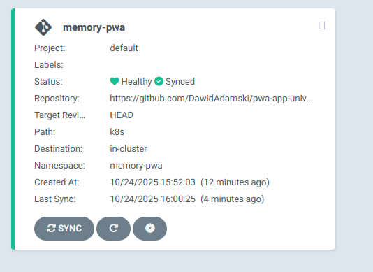
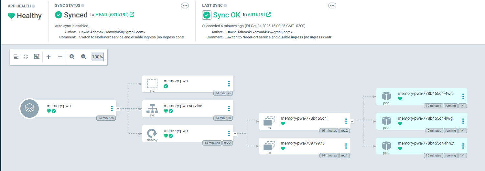

# Memory PWA - Kubernetes Deployment with ArgoCD

A Progressive Web App (PWA) for the classic Memory card game, deployed on Kubernetes with ArgoCD for GitOps automation.


## 🏗️ Architecture

```
┌─────────────────┐    ┌─────────────────┐    ┌─────────────────┐
│   GitHub Repo   │───▶│     ArgoCD      │───▶│   Kubernetes    │
│   (Source)      │    │   (GitOps)      │    │   (Minikube)    │
└─────────────────┘    └─────────────────┘    └─────────────────┘
```

## 🚀 Quick Start

### Prerequisites

- Kubernetes cluster (Minikube with Hyper-V)
- kubectl configured
- Podman/Docker for container builds
- Git repository (GitHub)

### 1. Build and Push Container Image

```bash
# Build and push the Memory PWA image
./build-docker.sh

# Or manually:
sudo podman build --network=host -t anihilat/pwa-memory:latest source/
sudo podman push anihilat/pwa-memory:latest
```

### 2. Deploy to Kubernetes

```bash
# Deploy using ArgoCD
argocd app create memory-pwa \
  --repo https://github.com/DawidAdamski/pwa-app-university.git \
  --path k8s \
  --dest-server https://kubernetes.default.svc \
  --dest-namespace memory-pwa \
  --sync-policy automated
```

### 3. Access the Application

```bash
# Port forward to access locally
kubectl port-forward -n memory-pwa service/memory-pwa-service 3000:80

# Access at: http://localhost:3000
```

## 🔄 ArgoCD GitOps Setup

### 1. Install ArgoCD

```bash
# Create namespace
kubectl create namespace argocd

# Install ArgoCD
kubectl apply -n argocd -f https://raw.githubusercontent.com/argoproj/argo-cd/stable/manifests/install.yaml

# Wait for ArgoCD to be ready
kubectl wait --for=condition=available --timeout=300s deployment/argocd-server -n argocd
```

### 2. Access ArgoCD UI

```bash
# Port forward ArgoCD server
kubectl port-forward -n argocd svc/argocd-server 8080:443

# Access ArgoCD at: https://localhost:8080
# Username: admin
# Password: (get with kubectl -n argocd get secret argocd-initial-admin-secret -o jsonpath="{.data.password}" | base64 -d)
```



### 3. Create ArgoCD Application

```bash
# Create application via CLI
argocd app create memory-pwa \
  --repo https://github.com/DawidAdamski/pwa-app-university.git \
  --path k8s \
  --dest-server https://kubernetes.default.svc \
  --dest-namespace memory-pwa \
  --sync-policy automated
```



## 📁 Repository Structure

```
memory-pwa/
├── source/                     # Application source code
│   ├── index.html             # Main HTML file
│   ├── styles.css             # Application styles
│   ├── app.js                 # Game logic
│   ├── sw.js                  # Service worker
│   ├── manifest.json          # PWA manifest
│   ├── package.json           # Dependencies
│   ├── Dockerfile             # Container definition
│   ├── icons/                 # PWA icons
│   └── generate-icons.js     # Icon generation script
├── k8s/                       # Kubernetes manifests
│   ├── namespace.yaml         # Namespace definition
│   ├── deployment.yaml        # Deployment configuration
│   ├── service.yaml           # Service definition
│   └── kustomization.yaml     # Kustomize configuration
├── images/                    # Documentation images
│   ├── memory app.png         # Application screenshot
│   ├── argocd.png            # ArgoCD dashboard
│   └── argocd2.png           # ArgoCD application view
├── build-docker.sh            # Docker build script
├── setup-argocd.sh           # ArgoCD setup script
└── README.md                  # This file
```

## 🔧 Configuration

### Environment Variables

- `PORT`: Application port (default: 3000)

### Resource Limits

- **Memory**: 128Mi request, 256Mi limit
- **CPU**: 50m request, 200m limit

### Health Checks

- **Liveness Probe**: HTTP GET on `/` every 10s
- **Readiness Probe**: HTTP GET on `/` every 5s

## 🌐 Networking

### Service Configuration

- **Type**: NodePort
- **Port**: 80 → 3000
- **NodePort**: 31167 (auto-assigned)
- **Selector**: app=memory-pwa

## 🔄 GitOps Workflow

### Automatic Deployment

1. **Code Push**: Developer pushes to GitHub
2. **ArgoCD Sync**: ArgoCD detects changes
3. **Auto Deploy**: Application updates automatically
4. **Health Check**: ArgoCD monitors deployment health

### Manual Sync

```bash
# Sync specific application
argocd app sync memory-pwa

# Sync all applications
argocd app sync --all
```

## 🛠️ Development Workflow

### 1. Local Development

```bash
# Start development server
cd source/
npm start

# Test PWA features
# - Install prompt
# - Offline functionality
# - Service worker
```

### 2. Build and Test

```bash
# Build container
./build-docker.sh

# Test locally
sudo podman run -d --network=host --name memory-pwa-test anihilat/pwa-memory:latest
```

### 3. Deploy to Kubernetes

```bash
# Push changes to GitHub
git add .
git commit -m "Update Memory PWA"
git push origin main

# ArgoCD will automatically sync
```

## 📊 Monitoring and Logs

### View Application Logs

```bash
# Pod logs
kubectl logs -n memory-pwa deployment/memory-pwa

# Follow logs
kubectl logs -f -n memory-pwa deployment/memory-pwa
```

### Check Application Status

```bash
# Pod status
kubectl get pods -n memory-pwa

# Service status
kubectl get svc -n memory-pwa

# ArgoCD application status
argocd app get memory-pwa
```

## 🔒 Security

### RBAC Configuration

- **Service Account**: default
- **Namespace**: memory-pwa
- **Permissions**: Standard pod permissions

### Resource Limits

- **Memory**: 128Mi-256Mi
- **CPU**: 50m-200m
- **Health Checks**: Configured

## 🚨 Troubleshooting

### Common Issues

1. **Image Pull Errors**
   ```bash
   # Check if image exists
   sudo podman images | grep anihilat/pwa-memory
   ```

2. **ArgoCD Sync Issues**
   ```bash
   # Check application status
   argocd app get memory-pwa
   
   # Force sync
   argocd app sync memory-pwa --force
   ```

3. **Service Not Accessible**
   ```bash
   # Check service endpoints
   kubectl get endpoints -n memory-pwa
   
   # Port forward for testing
   kubectl port-forward -n memory-pwa service/memory-pwa-service 3000:80
   ```

### Debug Commands

```bash
# Describe resources
kubectl describe pod -n memory-pwa -l app=memory-pwa
kubectl describe service -n memory-pwa memory-pwa-service

# Check events
kubectl get events -n memory-pwa --sort-by='.lastTimestamp'
```

## 📈 Scaling

### Horizontal Pod Autoscaler

```yaml
apiVersion: autoscaling/v2
kind: HorizontalPodAutoscaler
metadata:
  name: memory-pwa-hpa
  namespace: memory-pwa
spec:
  scaleTargetRef:
    apiVersion: apps/v1
    kind: Deployment
    name: memory-pwa
  minReplicas: 2
  maxReplicas: 10
  metrics:
  - type: Resource
    resource:
      name: cpu
      target:
        type: Utilization
        averageUtilization: 70
```

## 🔄 CI/CD Pipeline

### GitHub Actions (Optional)

```yaml
name: Deploy to Kubernetes
on:
  push:
    branches: [main]
jobs:
  deploy:
    runs-on: ubuntu-latest
    steps:
    - uses: actions/checkout@v3
    - name: Deploy to Kubernetes
      run: |
        kubectl apply -f k8s/
```

## 📚 Additional Resources

- [ArgoCD Documentation](https://argo-cd.readthedocs.io/)
- [Kubernetes Documentation](https://kubernetes.io/docs/)
- [PWA Documentation](https://web.dev/progressive-web-apps/)
- [Minikube Documentation](https://minikube.sigs.k8s.io/docs/)

## 🤝 Contributing

1. Fork the repository
2. Create a feature branch
3. Make your changes
4. Test locally and in Kubernetes
5. Submit a pull request

## 📄 License

MIT License - see LICENSE file for details.

## 🎉 Success!

Your Memory PWA is now running on Kubernetes with ArgoCD GitOps automation! 

- **Application**: http://localhost:3000 (via port forward)
- **ArgoCD UI**: https://localhost:8080 (via port forward)
- **GitHub**: https://github.com/DawidAdamski/pwa-app-university

Enjoy your fully automated GitOps deployment! 🚀